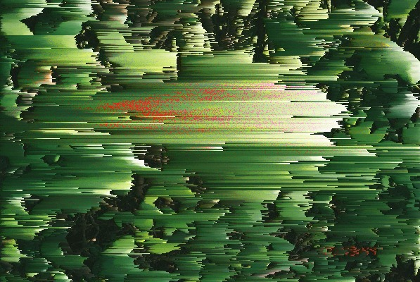

    

<h3 align="center">Pix-L SortR</h3>

  <a href="../../issues">Report an Issue</a>
  ·
  <a href="../../releases">Releases</a>
  ·
  <a href="/CHANGELOG.md">Change Log</a>

  <a href="#Description">Description</a>
  ·
  <a href="#Roadmap">Roadmap</a>

## Description
JavaScript based pixel sorter  

## Roadmap
Date | Issue | Status |
:--: | ----- | ------ |
22/05/2021 | Change download to multiple file types | incomplete |
22/05/2021 | Add shape cuts to output | incomplete |
22/05/2021 | Draw shape cuts to canvas | incomplete |
